# Overview of the code: 
Insurance carriers send claims for their members through a file, usually on a scheduled basis such as daily, weekly, or monthly. However, each insurance carrier uses a proprietary file format. And to import the data into a database, these files need to be standardized. 

Here are the high-level steps in this code: 
1) files are dropped into a directory
2) The files are filtered by filename pattern
3) The files are batched
4) The files are mapped to the standard format
5) Finally, an output file is created and dropped to a directory

In practice, clients send files through an SFTP and a scheduled job will run this code. Then, the output file is appended to a database table. Futhermore, there are separate jobs that focus on moving files to their correct location - such as a processing folder or archive folder. 

## Carrier files

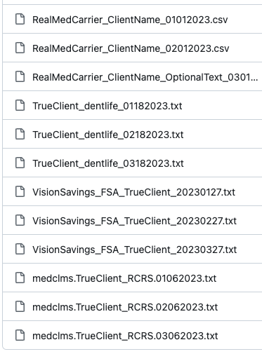

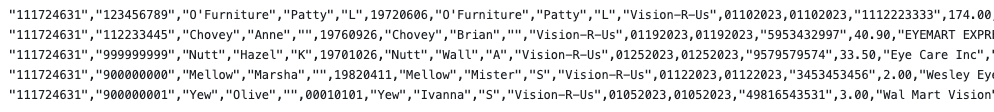
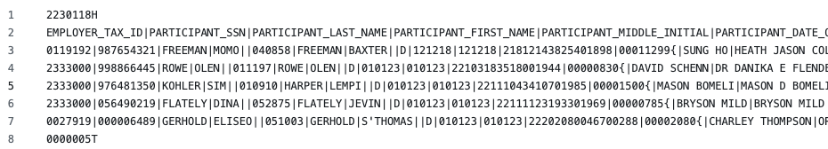
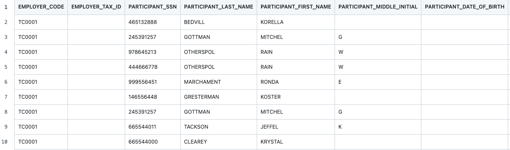
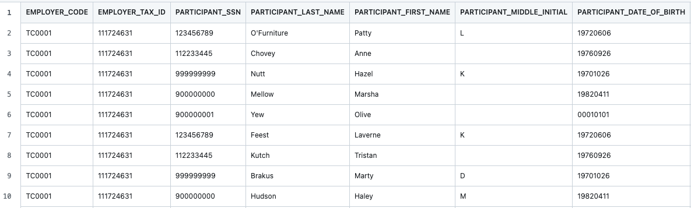

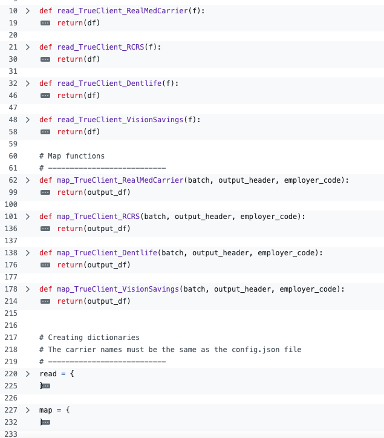
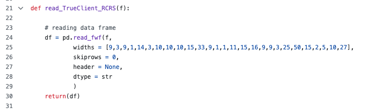
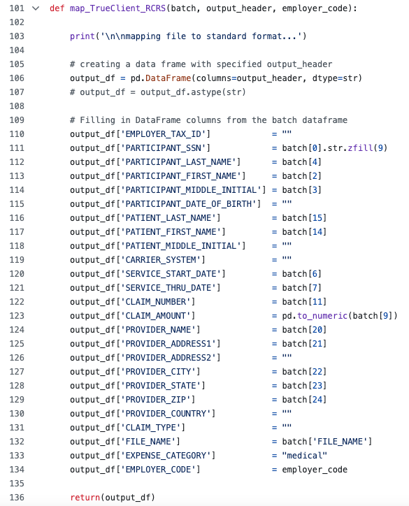
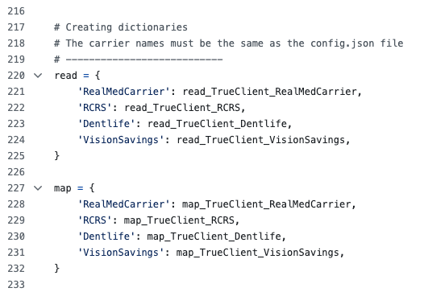
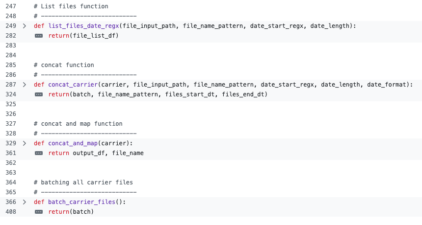

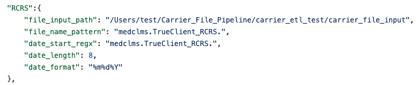
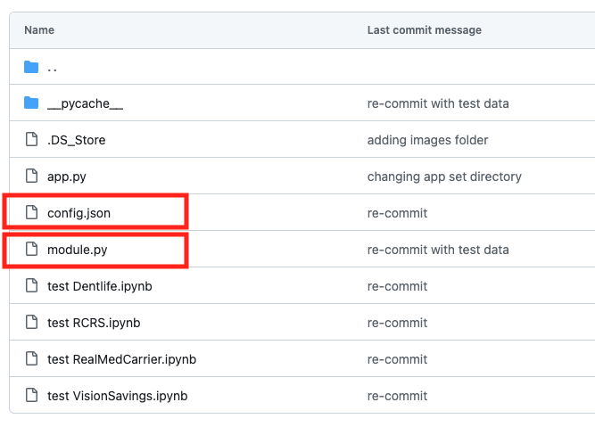
